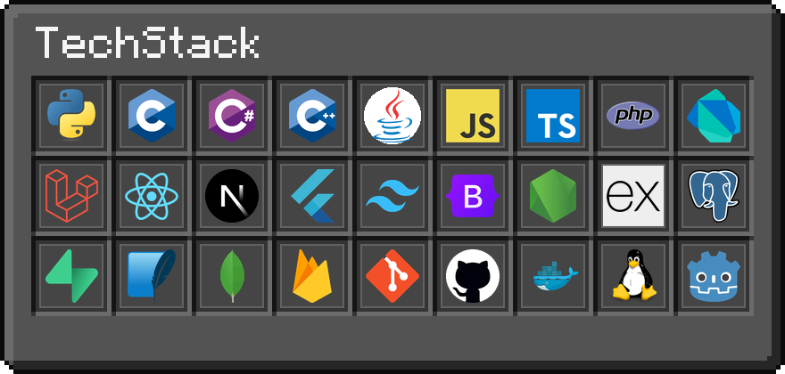
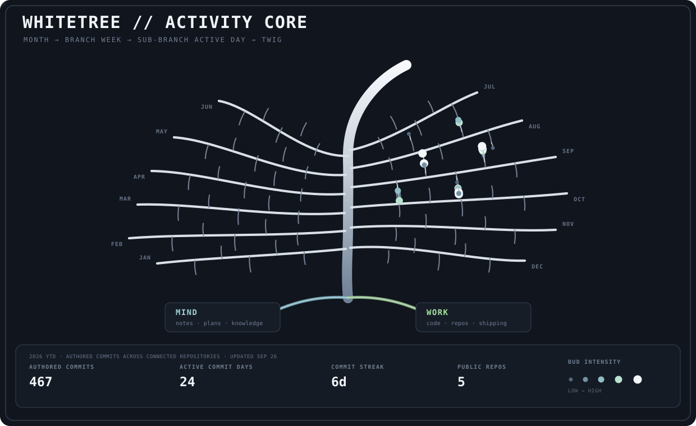

  

---

  

---

  

---

  

---

### 🎮 Beyond the code

Gaming and reading are my usual downtime. I also enjoy tinkering with my Linux setup and figuring out small ways to make my workflow better.

  Thanks for stopping by! 🍂

