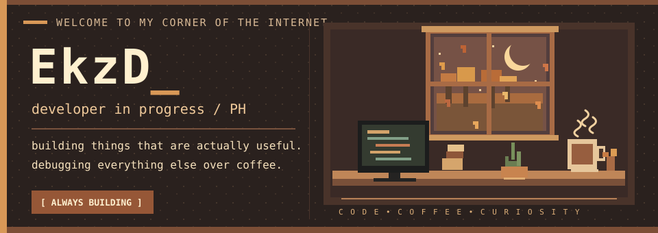

 

**hey, i'm EkzD.** 👋

a BSIT student from the Philippines who enjoys building useful software, 
automating the annoying stuff, and figuring out how things work.

 

 

### 🍁 a little about me

I like software that solves a real problem. My work spans **full-stack web apps, offline-first mobile apps, academic automation, and developer tooling**. Outside of writing code, you'll probably find me reading, gaming, or tinkering with my Linux setup.

<table>
  <tr>
    <td width="50%" valign="top">
      <strong>☕ what I enjoy building</strong>  
      Practical apps that make everyday tasks easier.  
      Automation that saves a few extra clicks.  
      Tools with thoughtful workflows and clean interfaces.
    </td>
    <td width="50%" valign="top">
      <strong>🪵 how I like to work</strong>  
      Start with the problem, not the feature list.  
      Keep things understandable and maintainable.  
      Build, test, break, learn, repeat.
    </td>
  </tr>
</table>

 

### 🧰 my toolbox

**languages**

  

**frontend & mobile**

  

**backend & databases**

  

**tools & infrastructure**

 

### 📜 the commit log

  

`a little code, a little coffee, a lot of curiosity.`

**thanks for stopping by 🍂**

